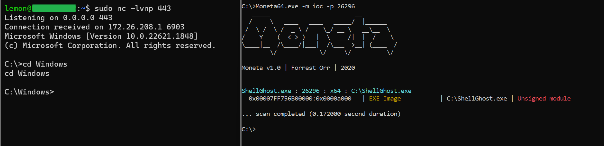
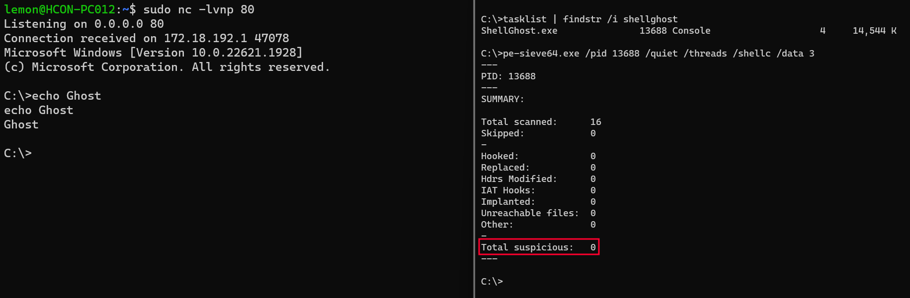
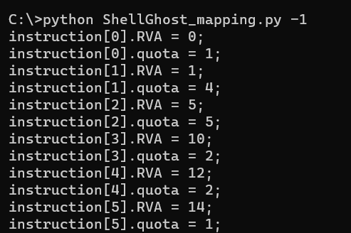
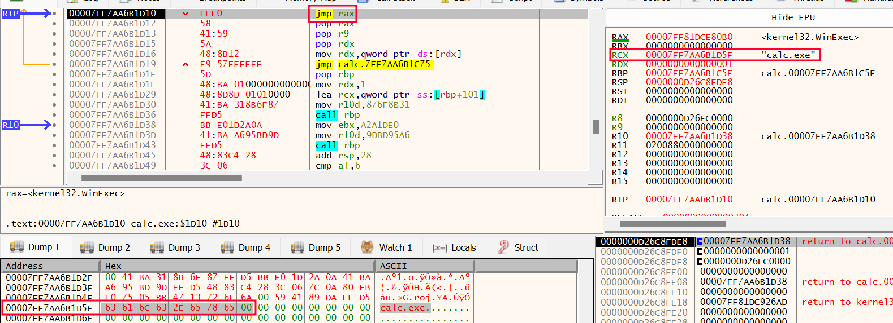
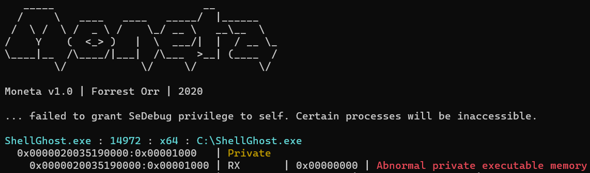

# ShellGhost


<p align="center">
  
</p>


__A memory-based evasion technique for droppers which makes shellcode invisible from process start to end.__

-----------------------------------------------------------------------------------------------------------------------------------------------------------------
## Motivation
I came up with ShellGhost after a Metasploit shellcode inside one of my droppers was flagged as malicious by an EDR solution. The EDR correctly detected the shellcode placed into the .text segment after decryption. That raised the need for having __a code that executes an 'invisible' shellcode from process start to finish__.


-----------------------------------------------------------------------------------------------------------------------------------------------------------------
## Handling the Thread Execution Flow
__ShellGhost relies on Vectored Exception Handling in combination with software breakpoints__ to cyclically stop thread execution, replace the executed breakpoint with a RC4-encrypted shellcode instruction, decrypt the instruction and resume execution after restoring memory protection to RX. When the subsequent EXCEPTION_BREAKPOINT is raised, the exception handler replaces the previous shellcode instruction with a new breakpoint so that the allocation will never disclose the complete shellcode in an unencrypted state. This happens inside a private memory page which is initially marked as READ/WRITE.
Having a RW PRV allocation will not be considered an 'Indicator of Compromise' by memory scanners such as PE-Sieve and Moneta. When the allocation becomes RX and the page is scanned, nothing but breakpoints will be found. This happens while the shellcode is actually under execution. The following picture shows that a reverse shell is running, but no IOC is found by Moneta (other than the binary being unsigned).





Trying to scan the process with Pe-Sieve has an even better outcome:





-----------------------------------------------------------------------------------------------------------------------------------------------------------------
## Shellcode Mapping
Shellcode Mapping is the core functionality of ShellGhost. This tactic enables the thread to intermittently execute instructions while never exposing the entire shellcode in memory. This is possible because the position of each single shellcode instruction that the thread executes corresponds to the position of a certain breakpoint inside the allocated memory page. ShellGhost resolves this position by calculating the Relative Virtual Address (RVA) from the thread RIP to the base address of the allocated memory page and adds it to the base address of the encrypted shellcode / encrypted instructions. The number of breakpoints that will be replaced is not always the same, but it varies depending on the number of opcodes that each instruction needs to be correctly generated and interpreted (QUOTA). So for example the instruction 'POP RBP' is equal to '5D', which means only one breakpoint will be replaced. By contrast, the instruction 'JMP RAX' requires opcodes 'FF E0', so two breakpoints will be replaced. For this reason I created the following C data structure.


```c
typedef struct CRYPT_BYTES_QUOTA {

	DWORD RVA;		// offset to encrypted instruction 
	DWORD quota;	// number of opcodes that generate the instruction

} CRYPT_BYTES_QUOTA, * PCRYPT_BYTES_QUOTA;
```

Breakpoints are not immediately replaced with their instruction counterparts. This is because instructions need to undergo a decryption routine before being executed. This is where the `DWORD quota` comes into play. ShellGhost relies on the now popular 'SystemFunction032' to perform RC4 decryption. Unlike XOR, RC4 is not a single-byte encryption scheme. This means that the shellcode cannot be encrypted and decrypted all at once. This is also another reason why each instruction is treated separately. After the breakpoints are replaced, the buffer length that SystemFunction032 needs will be equal to the 'instruction quota', which again represents the number of opcodes the specific instruction is composed of. So for example, consider the following snippet.


```c

CRYPT_BYTES_QUOTA instruction[200];
instruction[5].quota = 2

USTRING buf = { 0 }; 	// will contain the buffer to be decrypted and its length
USTRING key = { 0 }; 	// will contain the RC4 key and length

buf.Length = 2 		// buffer length, or length of the instruction to be decrypted

```

We know that shellcode instruction number 5 is composed of 2 opcodes, so a buffer length of 2 will be passed to SystemFunction032. This is important because trying to decrypt the entire shellcode with a single call to SystemFunction032 will corrupt it entirely.

### How is Shellcode Mapping performed?
The shellcode needs to be mapped with `ShellGhost_mapping.py` before compilation. The script extracts each single instruction and treats it as a small and independent shellcode. Instructions are encrypted one by one and printed out in C format all together as unsigned char. The result can be hardcoded inside the C code. Below is an example of what an encrypted MSF shellcode instructions for calc.exe looks like.


This shellcode has 98 instructions, so 98 CRYPT_BYTES_QUOTA structs are declared. When the code executes, these structs have to be populated with the proper instructions RVAs and QUOTAs. The '-1' parameter instructs the mapping script to print out the piece of code that does this.





## Adjusting Winapi Parameters
Metasploit x64 shellcodes tipically have winapi string parameters stored between instructions. So to say, a MSF x64 shellcode that calls Winexec does not push a series of bytes with a nullbyte at the end to have the first parameter string on the stack. Rather, the RCX register (first parameter) is a pointer inside the shellcode itself just like the following picture. 





This means that the breakpoints whose position relates to the string will never be resolved, because the RIP will never touch that position. As a matter of fact, this code resolves actual shellcode instructions the RIP goes through, not parameters that will never be executed like instructions. To fix this, I noticed that MSF shellcodes always store a pointer to the winapi they are calling inside the RAX register, then make a jump to the register itself. So when ShellGhost VEH detects that the resolved breakpoint is 'JMP RAX' and the RCX register contains a pointer to a position inside the shellcode, it attempts to also resolve what pointed by RCX. Subsequently, execution is not returned to the allocated memory. Rather, RAX (winapi address) is copied into RIP and thread execution is resumed from the winapi, thus overriding the 'JMP RAX' and keeping the allocated memory RW. This is needed for reverse shells calling WaitForSingleObject, which would cause the thread to sleep after the 'JMP RAX' while leaving memory RX for as long as the shell remains alive. The following code snippet contains the two conditions that has to be met in order for ShellGhost to adjust the RCX register when it contains a winapi parameter string and allow the MSF shellcode to correctly issue the function call (WinExec in the example here).


```c
<snip>
	
if (*(WORD*)(WORD*)exceptionData->ContextRecord->Rip == 0xe0ff) // if RIP is 'JMP RAX'

<snip>

if ((contextRecord->Rcx >= (DWORD64)allocation_base) && (contextRecord->Rcx <= ((DWORD64)allocation_base + sizeof(sh)))) // if RCX is inside the allocation

<snip>
```

RDX, R8 and R9 (second, third, and fourth parameters) are not covered yet.


## Differences and Similarities with other Techniques
[ShellcodeFluctuation](https://github.com/mgeeky/ShellcodeFluctuation) is a very similar in-memory evasion concept. Just like it, the allocated memory here 'fluctuates' from RW to RX. In contrast, ShellGhost introduces the following improvements:

* RC4 encryption plus 'Shellcode Mapping' rather than single-byte XOR
* No need to hook functions
* Support for Metasploit shellcodes


ShellGhost is far from being a perfect technique though. It still suffers from the biggest downside all these techniques have, namely __the need to have private executable memory at some point during execution__. More advanced techniques like [Foliage](https://github.com/y11en/FOLIAGE) already found a way around this. In addition, a memory allocation full of software breakpoints can be detected by a YARA rule. The following picture shows Moneta correctly detecting an IOC for the RX PRV allocation.





When it comes to evading an EDR solution, memory scanning is just part of a bigger picture. The complete absence of IOCs does not necessarily mean that a binary using this technique will prove effective against a given EDR. As far as I can tell, I experienced situations when the solution does not even allow you to launch the binary the way you're doing it. The other side of the medal is that IOCs are not always precise indicators, and some of them may turn out to be false positives. With that being said, this is just a raw technique and an inspiration which I hope the reader appreciates. The Red Teamer knows that just like the components of an EDR, in-memory evasion is only one component of the engine.


## References
* https://github.com/mgeeky/ShellcodeFluctuation
* https://github.com/y11en/FOLIAGE